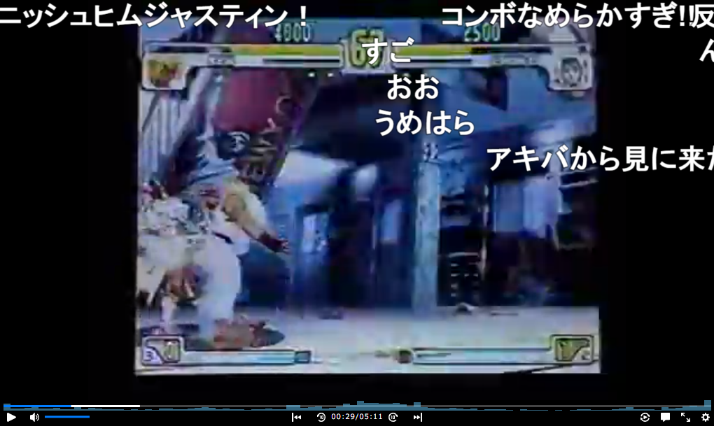
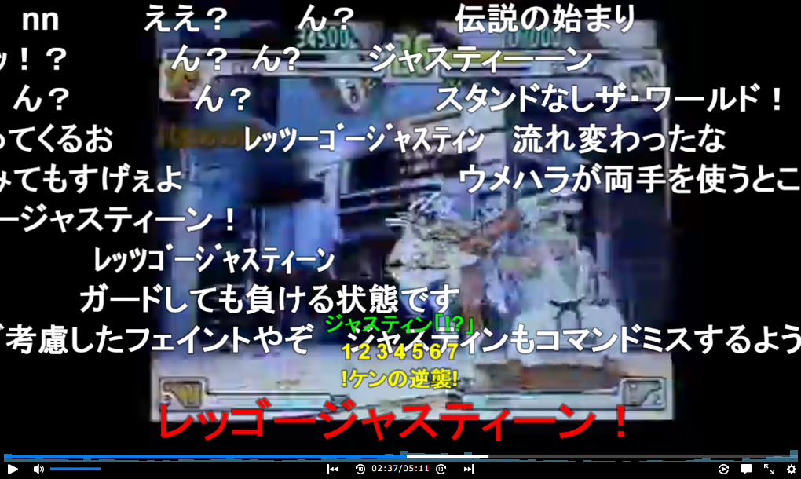

# Niconico Comment Grapher Chrome Extension


## 概要
ニコニコ動画のシークバー上に区間コメント数のグラフを描画するChrome拡張機能
コメント数の多い区間から動画の盛り上がりどころを推測可能


## サンプル




## ビルド手順
```
$ npm install
$ npx gulp [prod|dev]
```


## 未対応
- HTML5以外の動画
- 生放送
